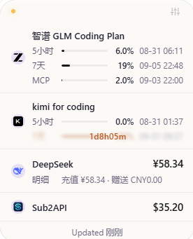
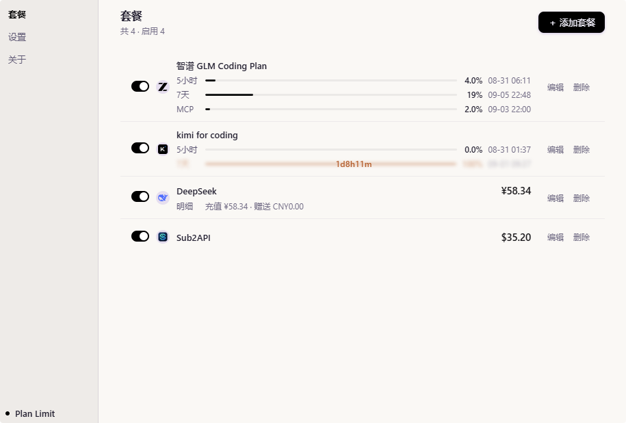
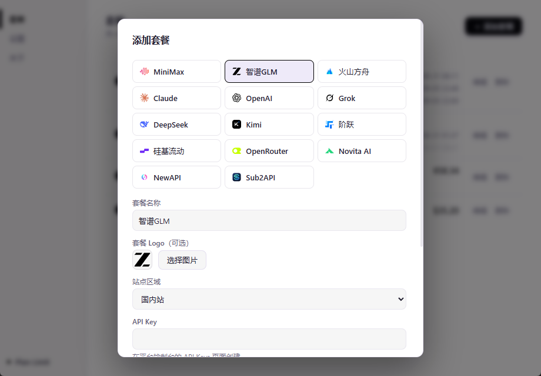
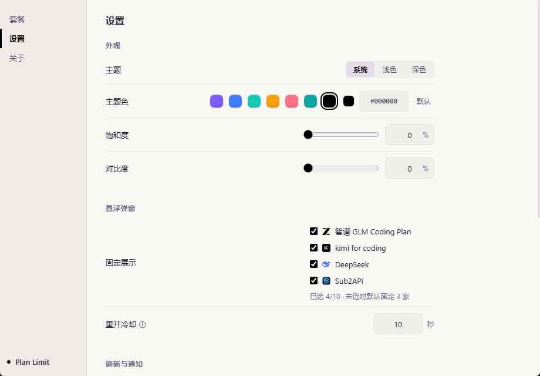

# Plan Limit

一款跨平台（Windows / macOS / Linux）的本地桌面工具：**把你的多个 AI Coding Plan / Token Plan 套餐额度聚合到一个托盘悬停小窗中，一目了然。**

- 技术栈：Tauri 2（Rust 后端）+ 原生 HTML/CSS/JS（无前端框架，无构建步骤）
- 安装包约 5 MB，运行内存占用低（复用系统 WebView）
- 所有数据仅保存在本地；API 密钥存入**系统凭据库**（Windows 凭据管理器 / macOS 钥匙串 / Linux Secret Service）
- 设计语言：Kimi Twilight（深空紫 × 原生质感）

## 界面预览

| 托盘悬浮面板（Windows 悬停即弹） | 主窗口（套餐管理） |
|---|---|
|  |  |

额度用尽的窗口自动进入**模糊遮罩 + 重置倒计时**（如 `1d8h11m`），鼠标悬停即揭开查看详情。

| 添加套餐（14 家内置模板） | 设置（主题色饱和度 / 对比度可调） |
|---|---|
|  |  |

## 下载安装（免打包）

打开 [Releases 页面](https://github.com/zander-zyx/coding-plan-limit/releases) 下载对应平台安装包：

| 系统 | 怎么选 | 文件 |
|---|---|---|
| Windows 10/11（64 位） | 常规 PC | `*-x64-setup.exe`（NSIS 向导，**可自行修改安装目录**） |
| macOS Apple 芯片（M1/M2/M3/M4…） | 2020 年末之后的 Mac 基本都是 | `*_aarch64.dmg`（拖入 Applications） |
| macOS Intel 芯片 | 2020 年前的老款 Mac | `*_x64.dmg`（拖入 Applications） |
| Linux | — | `*.AppImage` / `*.deb` |

> 不确定 Mac 是哪种芯片：点左上角  →「关于本机」，「芯片」一栏显示 **Apple M1/M2/M3/M4** 下载 `aarch64`，显示 **Intel** 下载 `x64`。装错了会提示无法运行，换另一个包即可。

### macOS 提示「App 已损坏，无法打开」？

安装包未做 Apple 签名与公证，首次打开会被 Gatekeeper 拦截并**误报「已损坏」**，文件本身是完好的。将 App 拖入「应用程序」文件夹后，任选其一放行：

- 终端执行（推荐）：

  ```bash
  xattr -cr "/Applications/Plan Limit.app"
  ```

- 或打开「系统设置 → 隐私与安全性」，页面底部点 **仍要打开**。

每次推送 `v*` 标签会自动构建并发布全平台安装包。

### 升级

内置更新：启动时 + 每 24 小时后台静默检查（可关）。有新版本时**主窗口侧边 / 弹窗标题栏出现更新按钮**，点击 = **应用内直接下载当前平台安装包**（按钮实时显示百分比），Windows 下载完成自动启动安装向导；也可在 托盘菜单 / 关于页 手动检查。

## 功能一览

| 功能 | 说明 |
|---|---|
| 托盘常驻 | 关闭主窗口即驻留托盘；**Windows 悬停图标弹出面板**（macOS/Linux 左键点击——系统 API 限制），打开即节流刷新 |
| 悬浮面板 | 固定展示 **1–10 家**自选套餐（未选默认 3 家，顺序跟随列表拖拽排序），点击卡片直达官网，其余收进"更多"折叠区 |
| 窗口明细 | **5小时 → 7天 → 月 → MCP** 固定排序，每窗口独立行（标签+进度条+百分比+重置时刻）；"有啥显示啥"，不支持的不报错 |
| 额度用尽遮罩 | 窗口用到 **100%** 自动模糊 + 居中显示重置倒计时（`1d3h24m` / `03h02m`），悬停揭开看详情，无明确重置时刻或余额型不参与 |
| 内置模板 | **14 个**（见下表），填密钥即用；官方订阅类读本机 CLI 登录凭据，零配置 |
| Codex 多账号 | 双轨支持：**捕获式**把当前 `codex login` 凭据存为套餐私有副本（只读、与 CC Switch 等工具零冲突）；**托管式**应用内 Device Code 登录多账号、自动刷新、任意套餐绑定任意账号 |
| 拖拽排序 | 套餐列表拖拽排序，持久化并决定弹窗展示/补足顺序 |
| 进度样式 | 平滑填充（默认）/ 环形（主窗口），弹窗统一行式 |
| 阈值通知 | 每套餐阈值（窗口型=剩余%、余额型=金额下限）；提醒频率三选一：不通知 / 按间隔 / 按次数；同告警不刷屏，紧急行变暖琥珀色 |
| 自定义外观 | 主题（系统/浅色/深色）、主题色（**预设含纯黑 + 拾色器 + #RRGGBB + 饱和度/对比度滑杆**，实时预览，弹窗跟随）、Logo 三态（原色/Mark/自定义图片，托盘+标题栏+侧边同步） |
| 数据本地 | 配置 `config.json`（损坏自动备份并拒绝写入）、密钥系统凭据库、快照 `snapshots.json` |

## 内置模板（14 个）

| 模板 | 数据内容 | 认证方式 |
|---|---|---|
| MiniMax Coding Plan | 5小时 / 7天窗口（周窗口未激活不显示） | API Key |
| 智谱 GLM Coding Plan | 5小时 / 7天 / 本月 / MCP（unit 缺失自动兜底分类） | API Key |
| Kimi For Coding | 5小时窗口 + 7天限额（重置时刻） | API Key |
| 火山方舟 Coding Plan | 5小时 / 7天 / 30天窗口（自动识别 Coding / Agent Plan） | 火山 IAM AccessKey |
| **Claude Official** | 官方订阅 5小时 / 7天 / Opus / Sonnet（读本机 `~/.claude/.credentials.json`，需 Claude CLI 已登录） | 无需密钥 |
| **OpenAI / ChatGPT** | 官方订阅窗口额度（读本机 `~/.codex/auth.json`，需 Codex CLI 已登录）；支持**多账号**（捕获副本 / 托管登录绑定） | 无需密钥 |
| **xAI Grok** | SuperGrok 订阅窗口额度（读本机 `~/.grok/auth.json`，需 Grok CLI 已登录） | 无需密钥 |
| DeepSeek | 账户余额（多币种优先 CNY） | API Key |
| Kimi / Moonshot | 账户余额（国内/国际站 Key 不通用，注意区域选择） | API Key |
| 阶跃星辰 StepFun | 账户余额 | API Key |
| 硅基流动 SiliconFlow | 账户余额（国际站 USD） | API Key |
| OpenRouter | 账户余额（含已用量明细） | API Key |
| Novita AI | 账户余额 | API Key |
| **NewAPI / OneAPI 站点** | 余额（填站点地址；币种跟随站点后台显示设置） | API Key |
| **Sub2API** | 余额（填站点地址，需兼容 OpenAI 计费接口） | API Key |

## 快速开始

1. **添加套餐**：托盘菜单 →「打开主界面」→ 套餐 →「＋ 添加套餐」→ 选品牌 → 填名称与密钥 → 保存
   - Claude / Codex / Grok：先在终端 `claude login` / `codex login` / `grok login`，应用自动读本机凭据
   - Codex 多账号：编辑套餐 →「捕获当前登录」存副本，或「登录新账号」后在下拉中绑定；可添加多个 Codex 套餐各查各号
   - NewAPI 系：填站点地址 + API Key（站点需兼容 `/v1/dashboard/billing/*`）
2. **悬浮窗**：设置 → 悬浮弹窗 → 勾选常驻套餐（1–10 家）；拖拽套餐列表调顺序，弹窗同步；点卡片跳官网
3. **通知**：每套餐设阈值（默认剩余 10%）；提醒频率按需选择；紧急窗口/进度条自动变暖琥珀色
4. **外观**：主题 / 主题色（预设含纯黑、`#RRGGBB`、饱和度/对比度滑杆）/ 进度样式 / Logo 三态（原色、Mark、自定义图片）

## 数据与隐私

| 内容 | 位置 |
|---|---|
| 套餐配置 + 设置 | `%APPDATA%\com.zander.coding-plan-limit\config.json`（Win）/ `~/Library/Application Support/...`（mac）/ `~/.config/...`（Linux） |
| API 密钥 | 系统凭据库；凭据库不可用时降级明文存入 config.json（会弹警告），凭据库恢复后自动清除明文 |
| 最近快照 | 同目录 `snapshots.json` |
| 配置损坏保护 | config.json 损坏时自动备份为 `config.corrupt.bak` 并**拒绝写入**，绝不静默丢数据 |

## 开发与构建

```bash
npm install
npm run dev      # 开发调试
npm run build    # 构建当前平台安装包
```

环境要求：Rust stable（+ MSVC / Xcode CLT / webkit2gtk）、Node.js ≥ 18。

辅助脚本：`scripts/render-mark.mjs`（Logo Mark 光栅化）、`scripts/make-icon.ps1`（默认图标重生成）、`dev-preview/index.html`（浏览器设计预览）。

## 已知限制

- macOS / Linux 托盘无系统悬停事件，弹窗为左键点击触发（Windows 悬停正常）
- macOS 的 Claude 凭据在钥匙串，claude-official 模板目前仅读取文件凭据（Windows/Linux）
- NewAPI 系币种跟随站点后台显示设置（API 无法自省）
- 待支持：火山引擎 Coding Plan（AK/SK 签名）、AWS Bedrock（CloudWatch）、xAI Grok 订阅（OAuth/gRPC）
- Claude/Codex 凭据过期会提示重新 login
